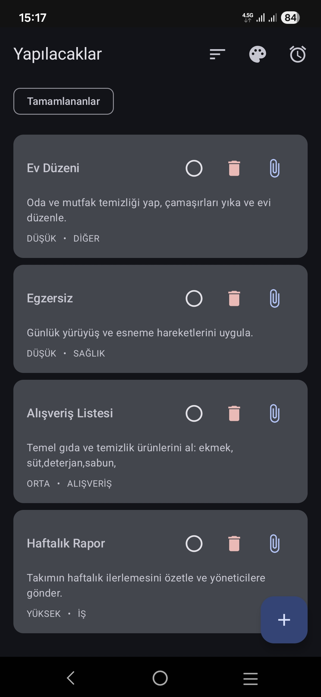
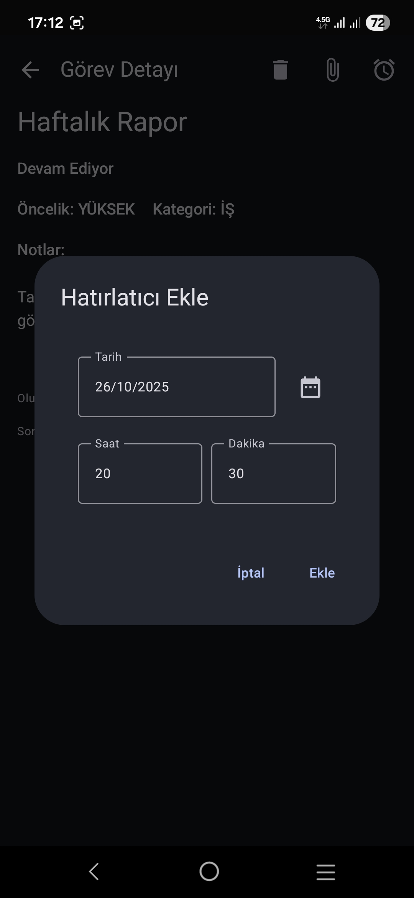
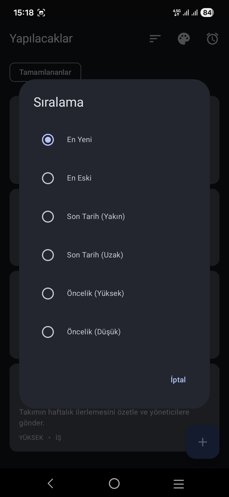
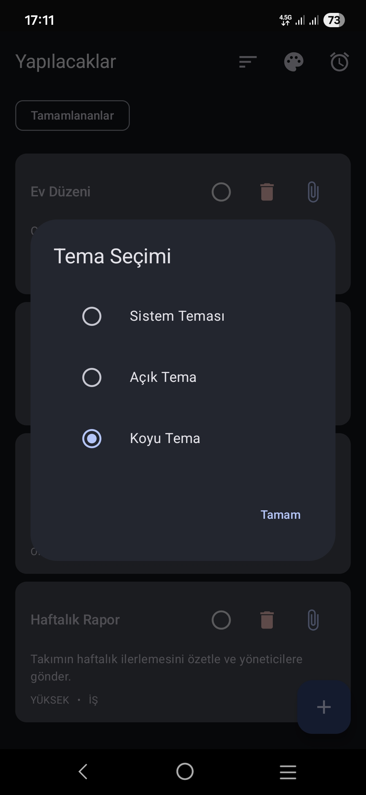
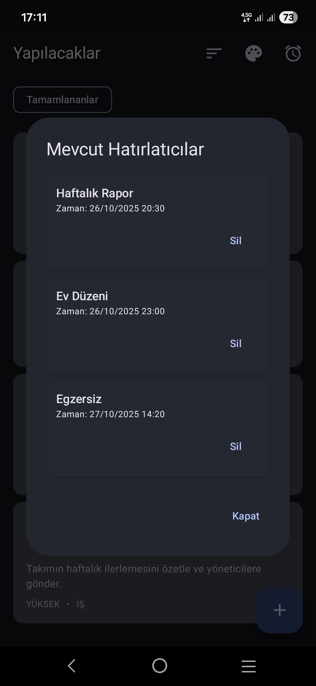
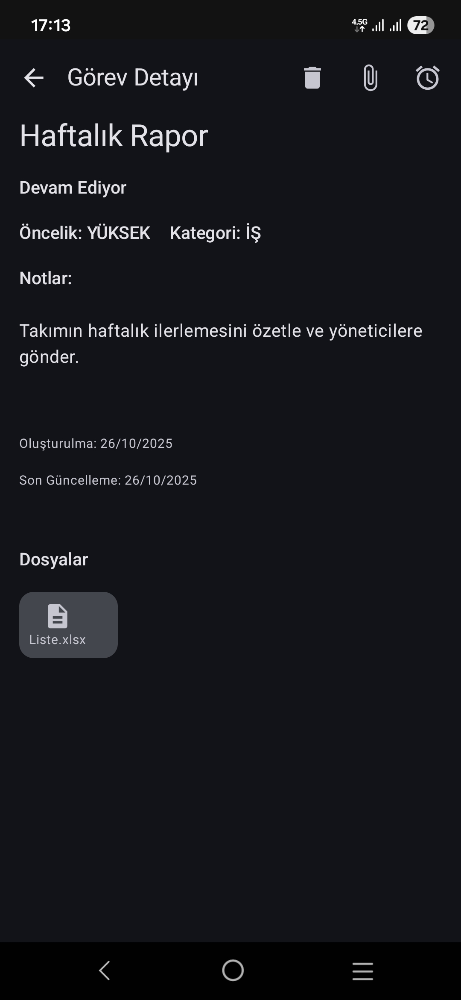
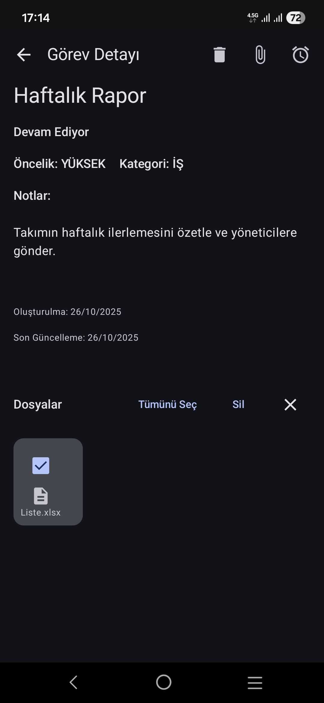
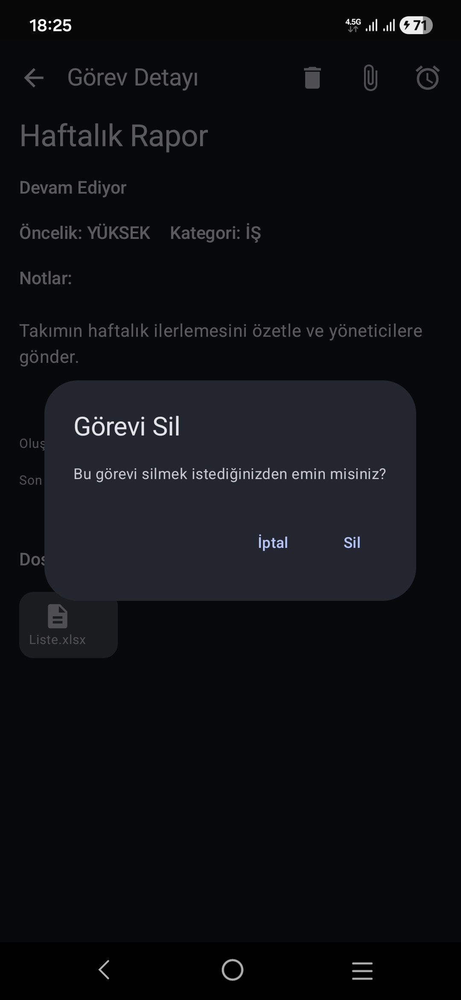

## ENG - ToDoList — Smart Task Manager for Android 🎯

An elegant, lightweight Android app to capture tasks, set timely reminders, and stay organized with a clean, modern UI. The APK is already available for download.

> Ready to try it? 🚀 [Get the latest build 📥](https://github.com/abdllhdlc/todoapp/releases/tag/v1.0-release)

---

### ✨ Features
- **Create, edit, and delete tasks** with a streamlined flow
- **Reminders and notifications** using exact alarms on supported devices
- **Offline-first local storage** powered by Room
- **Modern UI** built with Jetpack Compose and Material 3
- **Preferences storage** using DataStore
- **Optimized colors** via Palette for a polished look

---

### 🖼️ Screenshots

<table>
  <tr>
    <td></td>
    <td></td>
    <td></td>
    <td></td>
  </tr>
  <tr>
    <td></td>
    <td></td>
    <td></td>
    <td></td>
    <td></td>
  </tr>
</table>

---

### 📥 Installation

**Option A — Download APK (recommended):**
- Download the latest APK from the project's Releases:
  - [Latest Release](/../../releases/latest)
  - If available, grab the APK asset (for example: `app-release.apk`).

**Option B — Build from source:**
1. Clone this repository and open it in Android Studio (Giraffe+).
2. Ensure you have JDK 17 and Android SDK 34 installed.
3. Build and run:
   - From Android Studio: Run ▶ on a device/emulator
   - Or via terminal:
     - macOS/Linux: `./gradlew assembleDebug`
     - Windows: `gradlew.bat assembleDebug`
4. The APK will be in `app/build/outputs/apk/debug/`.

---

### 🛠️ Usage
1. Launch the app and tap the ➕ button to add a task.
2. Set a title, optional notes, and pick a date/time for reminders.
3. Save the task to schedule notifications.
4. Tap a task to edit or long-press to delete.

---

### 💻 Technologies Used
- **Language**: Kotlin
- **UI**: Jetpack Compose, Material 3
- **Data**: Room (SQLite), DataStore (Preferences)
- **Architecture Components**: ViewModel, Lifecycle
- **Utilities**: Gson, Palette
- **AndroidX**: Core KTX, Activity Compose, Navigation Compose

---

### ✉️ Contact / Author
**Author**: Abdullah Delice

For questions, feature requests, or bug reports, please open an Issue on this repository.

---

### ⚖️ License
This project is licensed under the **MIT License**. See the [LICENSE](LICENSE) file for details.

---

### ℹ️ App Details
- **App name**: ToDoList
- **Package**: `com.abdullah.todoapp`
- **Minimum SDK**: 24
- **Target SDK**: 34
- **Version**: 1.0 (1)

---

## TR - ToDoList — Android için Akıllı Görev Yöneticisi 🎯

Zarif ve hafif bir Android uygulaması: görevleri kaydedin, zamanında hatırlatmalar alın ve modern arayüzle düzenli kalın. APK indirilmeye hazırdır.

> 📥 Hemen denemek için aşağıdaki Releases sayfasından en güncel sürümü indirin.

---

### ✨ Özellikler
- **Görev ekleme, düzenleme ve silme** için yalın akış
- **Hatırlatmalar ve bildirimler** (desteklenen cihazlarda tam zamanlı alarmlar)
- **Yerel ve çevrimdışı depolama** (Room)
- **Modern arayüz** (Jetpack Compose, Material 3)
- **Tercih yönetimi** (DataStore)
- **Renk optimizasyonu** (Palette) ile şık görünüm

---

### 🖼️ Ekran Görüntüleri

<table>
  <tr>
    <td></td>
    <td></td>
    <td></td>
    <td></td>
  </tr>
  <tr>
    <td></td>
    <td></td>
    <td></td>
    <td></td>
    <td></td>
  </tr>
</table>

---

### 📥 Kurulum

**Seçenek A — APK indir (önerilir):**
- Projenin Releases bölümünden en güncel APK’yı indirin:
  - [En Son Sürüm](/../../releases/latest)
  - Varsa APK dosyasını indirin (ör. `app-release.apk`).

**Seçenek B — Kaynaktan derle:**
1. Bu depoyu klonlayın ve Android Studio (Giraffe+) ile açın.
2. JDK 17 ve Android SDK 34 kurulu olduğundan emin olun.
3. Derleyip çalıştırın:
   - Android Studio: ▶ ile cihaz/emülatörde çalıştırın
   - Terminal:
     - macOS/Linux: `./gradlew assembleDebug`
     - Windows: `gradlew.bat assembleDebug`
4. APK `app/build/outputs/apk/debug/` konumunda olacaktır.

---

### 🛠️ Kullanım
1. Uygulamayı açın, ➕ ile yeni görev ekleyin.
2. Başlık, notlar ve hatırlatma tarih/saatini ayarlayın.
3. Kaydedin; bildirim planlanacaktır.
4. Görevi düzenlemek için dokunun; silmek için uzun basın.

---

### 💻 Kullanılan Teknolojiler
- **Dil**: Kotlin
- **Arayüz**: Jetpack Compose, Material 3
- **Veri**: Room (SQLite), DataStore (Preferences)
- **Mimari Bileşenler**: ViewModel, Lifecycle
- **Yardımcılar**: Gson, Palette
- **AndroidX**: Core KTX, Activity Compose, Navigation Compose

---

### ✉️ İletişim / Yazar
**Yazar**: Abdullah Delice

Sorular, özellik istekleri veya hatalar için bu depoda Issue açabilirsiniz.

---

### ⚖️ Lisans
Bu proje **MIT Lisansı** ile lisanslanmıştır. Ayrıntılar için [LICENSE](LICENSE) dosyasına bakın.

---

### ℹ️ Uygulama Bilgileri
- **Uygulama adı**: ToDoList
- **Paket**: `com.abdullah.todoapp`
- **Minimum SDK**: 24
- **Hedef SDK**: 34
- **Sürüm**: 1.0 (1)
